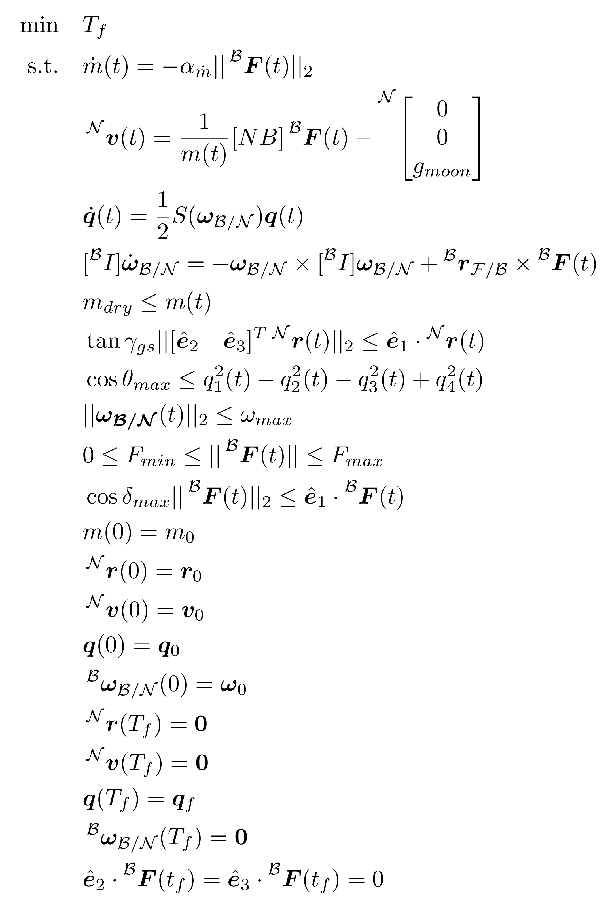
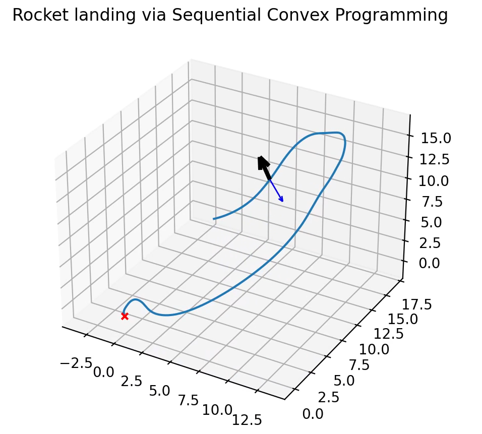
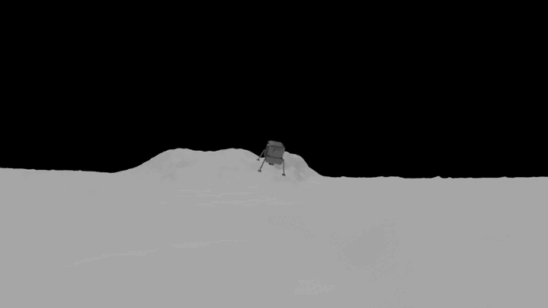
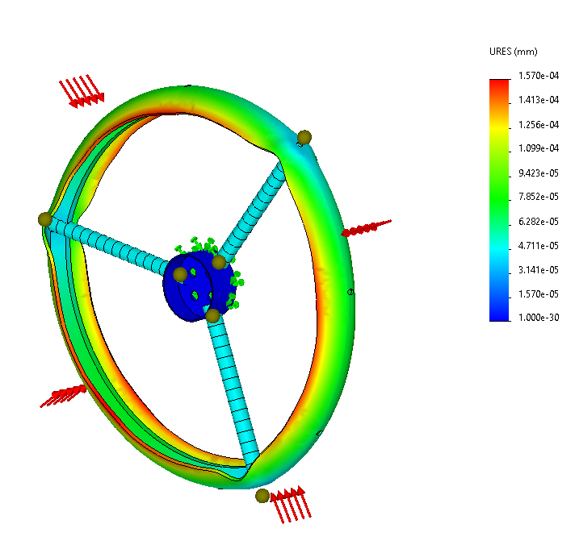
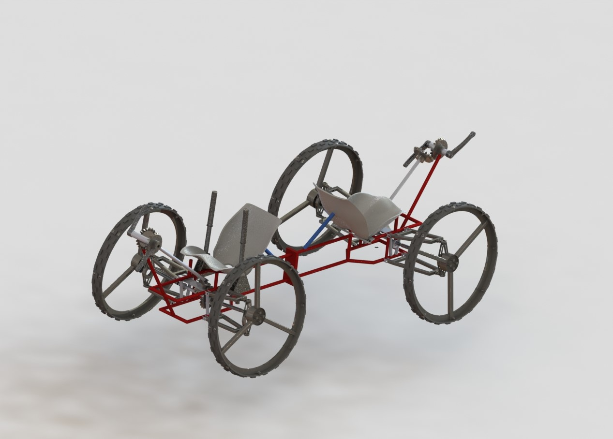

  

# LunaSats-UCB-Team

Our team is passionate about aerospace engineering research, and our goal is to strengthen our scientific research skills and thus, in the near future, seek to empower the next phase of space exploration of our country, Bolivia. We believe that promoting space science and technology to the Bolivian community is essential to achieve our goal. In order to achieve that, we want to show the younger students that they themselves can aspire to develop technology that will take us as far as space.

  <a href="#Section 1"><b>Rocket landing via Sequential Convex Programming</b></a> |
  <a href="#Section 2"><b>Section 3</b></a> |

## Rocket landing via Sequential Convex Programming

Rocket landing is one of the most exiting and challenging topics in spacecraft aerodynamics, specially if you are an enthusiastic student. Imagine, if this is a complex task in earth, the level increases even more outside it. Ones of the most important variables needed to be taken into consideration when talking about rocket landing are those related to aerodynamics forces. We can make a mention on lift and thrust, variables that could be easily calculated in earth, but what about the moon, or other locations outside the earth? In order to achieve good control over those variables, in places outside the earth, we need to know about the atmospheric drag and disturbance torques of the place where we want to land the rocket; where we can make a remark of magnetic torque or solar pressure force, among others.

  

  

  

## Section 2
In order to evaluate the performance of the Rocket landing and rover, certain variables need to be measured and correspond to Lunasat sensors’ that include:
- Temperature sensor: The temperature is the most important variable to measure because of its influence in the atmospheric drag disturbance, since temperature is directly relationated with density and so with this disturbance. Furthermore, the temperature can be interpreted as a danger parameter since all embedded components in telemetry systems work optimally in a specific range of temperatures. Also, it is a critical factor in the entire structure of the rover because the temperature coefficient of materials can determine how all parts of the vehicle will dilate or contract.
- Accelerometer: Acceleration is useful for determining the velocity of the spacecraft since it is an important variable to control it. And also for the rover because we are able to compute the travel time and the force that is required to overcome obstacles with slope.
- Magnetometer: The magnetic field can conditionate the control performance of the spacecraft since one of the most influential disturbances is the magnetic disturbance due to the interaction of the Moon’s magnetic field and the magnetic dipole of the spacecraft. By measuring the magnetic field we can determine the maximum perturbation from the external magnetic field,and so estimate and simulate the spacecraft  performance. Additionally, this variable can affect the telemetry system of the vehicle since the magnetic field is useful for orientation approaches.
- Thermopile: Due to the limited battery available, this component can wake-up battery only when something is detected. For example, if there were a kind of obstacle near, a braking system can be activated saving an important amount of energy. The detection of nearby obstacles is an important issue, since the rover structure is made of metals such as steel and aluminum, and if the vehicle collides, a phenomenon called cold welding can occur.Where, due to the absence of oxygen, pieces of metal can fuse, without the need for a conventional welding technique. Even tought the Von Misses stress analysis shows a clear resistance (for example in wheels), the impact can cause pieces of metal to come together and fuse.

  

  
   

