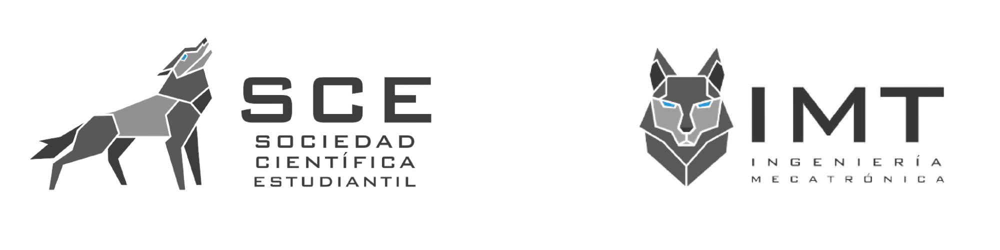

  

# LunaSats-UCB-Team

Our team is passionate about aerospace engineering research, and our goal is to strengthen our scientific research skills and thus, in the near future, seek to empower the next phase of space exploration of our country, Bolivia. We believe that promoting space science and technology to the Bolivian community is essential to achieve our goal. In order to achieve that, we want to show the younger students that they themselves can aspire to develop technology that will take us as far as space.

  <a href="#Section 1"><b>Section 1</b></a> |
  <a href="#Section 2"><b>Section 2</b></a> |
  <a href="#Section 3"><b>Section 3</b></a> |

## Rocket landing via Sequential Convex Programming

## Section 2

## Section 3
